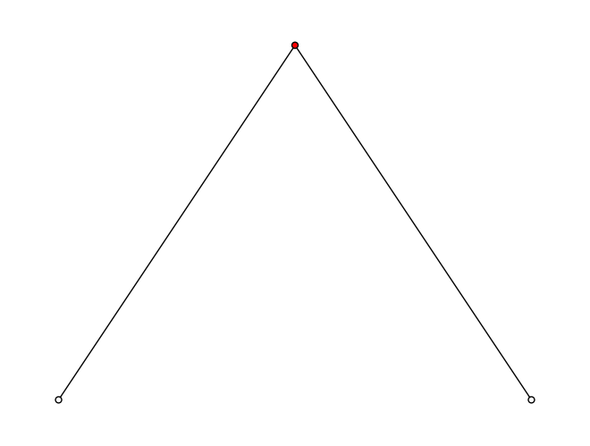
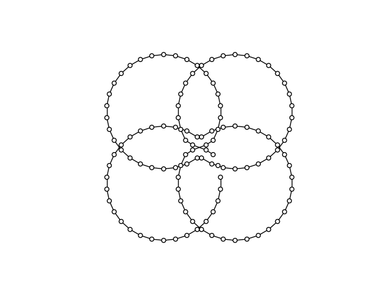

# Weniger Krumme Touren

❔ A1 👤 64712 🧑 Leonhard Masche 📆 01.04.2023

## Inhaltsverzeichnis

1. [Lösungsidee](#lösungsidee)
2. [Umsetzung](#umsetzung)
    1. [Verbesserungen](#verbesserungen)
    2. [Qualität der Ergebnisse](#qualität-der-ergebnisse)
3. [Beispiele](#beispiele)
4. [Quellcode](#quellcode)

## Lösungsidee

Das Netz der Außenposten wird als Graph betrachtet.
Gegeben sei ein kompletter Graph $G(V, E)$, der die möglichen Verbindungen zwischen den einzelnen Knoten darstellt.
$V$ stellt Menge der Außenposten, und $E$ ist die Menge der möglichen Verbindungen dieser dar.
Nun gilt es als Lösung einen Hamilton-Graph $L(V, E_L)$ zu konstruieren, der die Bedingungen $E_L \subset E$ und $|E_L| = |V| - 1$ erfüllt.
Zusätzlich dazu müssen auch noch die Vorgaben aus der Aufgabenstellung (keine Abbiegewinkel über $90°$ und die Minimierung der Strecke) beachtet werden.

Für eine arbiträre Liste von Außenstellen und deren Koordinaten kann nicht immer eine Lösung gefunden werden. Das Liegt daran dass es sein kann, dass eine Außenstelle keine zwei Nachbaren hat, mit denen sie einen Abbiegewinkel unter $90°$ bilden kann. Hier ein Beispiel:


Wie man sieht kann hier (leicht überprüfbar) kein Pfad gefunden werden, der die verlangten Anforderunge erfüllt.

Modelliert wird diese Aufgabenstellung mit einem Integer-Linear-Programming Modell, bestehend aus einer Matrix von binären Variablen die angeben, ob zwischen zwei Knoten ein Verbindung besteht.

Diese Aufgabe (die Suche nach einem optimalen Pfad) ähnelt sehr stark dem Travelling-Salesman-Problem, und teilt mit diesem auch seine Klassifizierung als NP-Schwer. Während eine Suche nach einer Lösung, die die Abiegewinkel- und Grapheigenschaften-Vorgaben erfüllt durch ILP auf ein SAT-Problem reduziert werden kann und somit NP-Komplett ist, ist die Suche nahc einer optimale Lösung NP-Schwer, da sich eine Lösung nicht in Polynom-Zeit verifizieren lässt. Ein ähnlicher Aufwand muss für den Beweis der Unauffindbarkeit einer möglichen Route vollbracht werden. Dieser Befindet sich als Umkehrung des vorher genannten SAT-Problems in der Klasse co-NP. TODO check this

## Umsetzung

Wie vorher genannt wird die Aufgabenstellung als Integer-Linear-Programming Problem formuliert. Hierzu wird eine Matrix an binären Variablen mit den Indices $-1, ..., |V|-1$ erstellt, die besagt, ob ein Knoten $i$ mit dem Knoten $j$ verbunden ist. Der Index $-1$ ist dafür zuständig, den Start und das Ende der Tour zu markieren und wird in der Wegkostenberechnung nicht berücksichtigt. $W$ sei $V\cup\set{-1}$.

Um bei jedem Knoten einen Grad von $\delta(v)=2\quad v\in W$ sicherzustellen, werden zwei Bedingungen eingeführt:
$$\sum_{j\in W}x_{ij} = 1\qquad i \in W\tag 1$$
$$\sum_{i\in W}x_{ij} = 1\qquad j \in W\tag 2$$

Als weitere Bedingung müssen noch disjunkte Teilstrecken verhindert werden. Diese entstehen wenn ein Knoten mit einem Knoten verbunden ist, der schon vorher in der Tour enthalten war. Diese Bedingung wird für den Knoten $-1$ nicht durchgesetzt, da dieser sowohl am Start, als auch am Ende der Tour enthalten sein muss. Um diese Bedingung zu modellieren werden entsprechend der MTZ-Methode $t_i \quad i \in V$ weitere ganzzahlige Variablen eingeführt, welche die Position der Knotenpunkte in der Tour angeben. Zusätzlich wird diese Bedingung aufgestellt:

$$x_{ij} \implies t_i < t_j \qquad (i, j) \in V^2 \tag 3$$

Zuletzt muss noch die Winkel-Vorgabe berücksichtigt werden. Sei $p_i$ die Koordinate von Knoten $i$. Vor dem eigentlichen Vorgang des Lösens werden alle Winkel mit dem Kreuzprodukt von Vektoren vorberechnet und in einer 3d-Matrix $a$ gespeichert. So ergibt sich:
$$x_{ij} \wedge x_{jk} \implies a_{ijk} \le 90 \qquad (i, j, k) \in V^3 \tag 4$$

Als zu minimierende Funktion wird der Gesamtweg berechnet. $c_{ij}\quad (i, j)\in V^2$ sei der Abstand zwischen den Knoten $i$ und $j$.
$$\text{minimize}\quad\sum_{i \in V}\sum_{j \in V}c_{ij} x_{ij}\tag{5}$$

Im Quelltext sind diese Beschränkungen in linearisierter Form zu finden.
Das Programm ist in der Sprache Python umgesetzt und ab der Version `3.6` ausführbar. Zur Lösung wird die von Google entwicklete Bibliothek `ortools` neben einigen anderen Paketen verwendet, die mit `pip install -r requirements.txt` installiert werden können. Das Programm erstellt das ILP-Modell, sucht mit einem Zeitlimit von 2 Minuten nach einer Lösung und gibt diese aus.

### Verbesserungen

#### Jahre später

In den ersten Zeilen des Programms finden sich Konstanten, mit denen sich das Verhalten des Programms anpassen lässt. So zum Beispiel auch die maximale Berechnungszeit...

```python
ANGLE_UPPER_BOUND = 90
ANGLE_COST_FACTOR = 0
SOLVER_MAX_TIME = 60 * 2    # 2 Minuten Berechnungszeit
```

#### Maximaler Winkel

Anton hat ein neues Gefährt bekommen! Jetzt kann er Abbiegewinkel von `110°` meistern. In den Parametern kann auch der maximale Abbiegewinkel angepasst werden (`ANGLE_UPPER_BOUND`).

#### Abbiegewinkel-Minimierung

Einer der weiteren anpassbaren Parameter (`ANGLE_COST_FACTOR`) fügt den maximalen Abbiegewinkel als Teil der Kostenfunktion hinzu. So kann auch dieser optimiert werden. Ein guter Wert scheint `0.005` zu sein. Allerdings wird die Suche dadurch sehr viel langsamer. Hier ein Ergebnis für Beispiel 3 mit Weglänge `4533.97km` und Winkel-UB `33°`, das mit einer Maximalzeit von 20 Minuten berechnet wurde:



#### Halbierung der Anzahl der berechneten Winkel

Da der Winkel $a_{kji}$ gleich dem Winkel $a_{ijk}$ ist, wird nur letzerer berechnet, und für diesen nun Bedingungen in beide Richtungen ($x_{ij} \wedge x_{jk}$ und $x_{kj} \wedge x_{ji}$) hinzugefügt. Die Anzahl der vorberechneten Winkel wird somit halbiert.

### Qualität der Ergebnisse

Das Integer-Linear-Programming Verfahren ist in der Lage, optimale Ergebnisse zu liefern ('optimal' heißt hier nicht 'exklusiv optimal'). Da aber einige sehr große Instanzen bearbeitet werden, wird in zwei Minuten meist nur eine sinnvolle Lösung erreicht.

2min 14 core

lp relax

## Beispiele

## Quellcode
