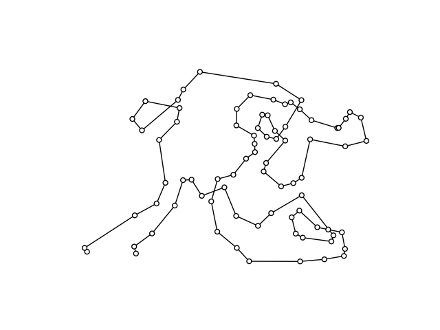

# Weniger Krumme Touren

❔ A1 👤 64712 🧑 Leonhard Masche 📆 01.04.2023

## Inhaltsverzeichnis

1. [Lösungsidee](#lösungsidee)
2. [Umsetzung](#umsetzung)
    1. [Verbesserungen](#verbesserungen)
    2. [Qualität der Ergebnisse](#qualität-der-ergebnisse)
3. [Beispiele](#beispiele)
4. [Quellcode](#quellcode)

## Lösungsidee

Das Netz der Außenposten wird als Graph betrachtet.
Gegeben sei ein kompletter Graph $G(V, E)$, der die möglichen Verbindungen zwischen den einzelnen Knoten darstellt.
$V$ stellt Menge der Außenposten, und $E$ ist die Menge der möglichen Verbindungen dieser dar.
Nun gilt es als Lösung einen Hamilton-Pfad $L(V, E_L)$ zu konstruieren, der die Bedingungen $E_L \subset E$ und $|E_L| = |V| - 1$ erfüllt.
Zusätzlich dazu müssen auch noch die Vorgaben aus der Aufgabenstellung (keine Abbiegewinkel über $90°$ und die Minimierung der Strecke) beachtet werden.

Für eine arbiträre Liste von Außenstellen und deren Koordinaten kann nicht immer eine Lösung gefunden werden. Das Liegt daran dass es sein kann, dass eine Außenstelle keine zwei Nachbaren hat, mit denen sie einen Abbiegewinkel unter $90°$ bilden kann. Hier ein Beispiel:


Wie man sieht kann hier (leicht überprüfbar) kein Pfad gefunden werden, der die verlangten Anforderungen erfüllt.

Modelliert wird diese Aufgabenstellung mit einem Integer-Linear-Programming Modell, bestehend aus einer Matrix von binären Variablen die angeben, ob zwischen zwei Knoten eine Verbindung besteht.

Diese Aufgabe (die Suche nach einem möglichst kurzen Pfad) ähnelt sehr stark dem Travelling-Salesman-Problem, und teilt mit diesem auch seine Klassifizierung als NP-Schwer. Während die Suche nach einer beliebigen Lösung, die die Abiegewinkel- und Vorgaben zu den Grapheigenschaften erfüllt durch ILP auf ein SAT-Problem reduziert werden kann und somit NP-Komplett ist, ist die Suche nach einer optimalen Lösung NP-Schwer, da sich eine Lösung nicht in Polynom-Zeit verifizieren lässt. Ein ähnlicher Aufwand muss für den Beweis der Unauffindbarkeit einer möglichen Route vollbracht werden. Dieser Befindet sich als Umkehrung des vorher genannten SAT-Problems in der Klasse co-NP.

## Umsetzung

Wie vorher genannt wird die Aufgabenstellung als Integer-Linear-Programming Problem formuliert. ($W$ sei $V\cup\set{-1}$.) Hierzu wird eine 2d-Matrix an binären Variablen $x_{ij}\quad(i,j)\in W$ erstellt, die besagt, ob ein Knoten $i$ mit dem Knoten $j$ verbunden ist. Der Index $-1$ wird verwendet, um den Start und das Ende der Tour zu markieren und wird in der Wegkosten- und Winkelberechnung nicht berücksichtigt.

Um bei jedem Knoten einen Grad von $\delta(v)=2\quad v\in W$ sicherzustellen, werden zwei Bedingungen eingeführt:
$$\sum_{j\in W}x_{ij} = 1\qquad i \in W\tag 1$$
$$\sum_{i\in W}x_{ij} = 1\qquad j \in W\tag 2$$

Als weitere Bedingung müssen noch disjunkte Teilstrecken verhindert werden. Diese entstehen wenn ein Knoten mit einem Knoten verbunden ist, der schon vorher in der Tour enthalten war. Diese Bedingung wird für den Knoten $-1$ nicht durchgesetzt, da dieser sowohl am Start, als auch am Ende der Tour enthalten sein muss. Um diese Bedingung zu modellieren werden entsprechend der [MTZ-Methode](https://how-to.aimms.com/Articles/332/332-Miller-Tucker-Zemlin-formulation.html) $t_i \quad i \in V$ weitere ganzzahlige Variablen eingeführt, welche die Position der Knotenpunkte in der Tour angeben. Zusätzlich wird diese Bedingung aufgestellt:

$$x_{ij} \implies t_i < t_j \qquad (i, j) \in V^2 \tag 3$$

Zuletzt muss noch die Winkel-Vorgabe berücksichtigt werden. Vor dem eigentlichen Vorgang des Lösens werden alle Winkel mit dem Kreuzprodukt von Vektoren vorberechnet und in einer 3d-Matrix $a$ gespeichert. So ergibt sich:
$$x_{ij} \wedge x_{jk} \implies a_{ijk} \le 90 \qquad (i, j, k) \in V^3 \tag 4$$

Als zu minimierende Funktion wird der Gesamtweg berechnet. $c_{ij}\quad (i, j)\in V^2$ sei der Abstand zwischen den Knoten $i$ und $j$.
$$\text{min}\quad\sum_{i \in V}\sum_{j \in V}c_{ij} x_{ij}\tag{5}$$

Im Quelltext sind diese Beschränkungen in [linearisierter](https://download.aimms.com/aimms/download/manuals/AIMMS3OM_IntegerProgrammingTricks.pdf) Form zu finden.
Das Programm ist in der Sprache Python umgesetzt und ab der Version `3.6` ausführbar. Zur Lösung wird die von Google entwicklete Bibliothek [`ortools`](https://developers.google.com/optimization) neben einigen anderen Paketen verwendet, die mit `pip install -r requirements.txt` installiert werden können. Das Programm erstellt das ILP-Modell, sucht dann mit einem Zeitlimit von 3 Minuten nach einer Lösung und gibt diese aus. Zusätzlich zu einer graphischen Darstellung mithilfe von `networkx` und `pyplot` werden in der Datei `output/wenigerkrumm{}.txt` die Koordinaten ausgegeben, die Anton in sein Navi eingeben muss. Da der Pfad in beide Richtungen abgefahren werden kann, ist es egal ob er am Ende oder Anfang der Datei anfängt.

### Verbesserungen

#### Jahre später

In den ersten Zeilen des Programms finden sich Konstanten, mit denen sich das Verhalten des Programms anpassen lässt. So zum Beispiel auch die maximale Berechnungszeit...

```python
ANGLE_UPPER_BOUND = 90
ANGLE_COST_FACTOR = 0       # 0.002
SOLVER_MAX_TIME = 60 * 3    # 3 Minuten Berechnungszeit
```

#### Maximaler Winkel

Anton hat ein neues Gefährt bekommen! Jetzt kann er Abbiegewinkel von `110°` meistern. In den Parametern kann auch der maximale Abbiegewinkel angepasst werden (`ANGLE_UPPER_BOUND`). Hier Beispiel 5 mit einem `ANGLE_UPPER_BOUND` von `110`. So kann in `36.91s` eine optimale Strecke mit Weglänge `2860.31km` gefunden werden.


#### Abbiegewinkel-Minimierung

Einer der weiteren anpassbaren Parameter (`ANGLE_COST_FACTOR`) ermöglicht, den maximalen Abbiegewinkel zu verändern, sodass auch dieser optimiert werden kann. Ein guter Wert scheint `0.002` zu sein. Allerdings wird die Suche dadurch sehr viel langsamer, da die Variable `angle_ub` im ILP-Modell nun nichtmehr auf den Wert von `ANGLE_UPPER_BOUND` fixiert werden kann. Hier ein Ergebnis für Beispiel 3 mit Weglänge `1939.08km` und Winkel-UB `33°`, das mit einer Maximalzeit von 20 Minuten berechnet wurde:


#### Halbierung der Anzahl der berechneten Winkel

Da der Winkel $a_{kji}$ gleich dem Winkel $a_{ijk}$ ist, wird nur letzerer berechnet, und für diesen nun Bedingungen in beide Richtungen ($x_{ij} \wedge x_{jk}$ und $x_{kj} \wedge x_{ji}$) hinzugefügt. Die Anzahl der vorberechneten Winkel wird somit halbiert.

#### Halbierung der Anzahl der berechneten Distanzen

Da die Distanz $c_{ji}$ gleich der Distanz $c_{ij}$ ist, wird nur letzere berechnet, und für diese nun Bedingungen in beide Richtungen ($x_{ij}$ und $x_{ji}$) hinzugefügt. Die Anzahl der berechneten Distanzen wird somit halbiert.

#### Rote Farbe

Abbiegewinkel in der Lösung, die größer als `ANGLE_UPPER_BOUND` sind, werden rot markiert (siehe oben). Dieser Effekt ist praktisch nicht zu beobachten, aber dennoch ein nützlicher Überprüfungsmechanismus.

### Qualität der Ergebnisse

Das Integer-Linear-Programming Verfahren ist in der Lage, optimale Ergebnisse zu finden ('optimal' heißt hier nicht 'exklusiv optimal'). Da aber einige sehr große Instanzen bearbeitet werden, werden in drei Minuten teilweise nur sinnvolle Lösungen erreicht.

Das liegt daran, dass im ILP-Modell sowohl Variablen als auch Bedingungen in grob quadratisch wachsender Anzahl erstellt werden. Auf einem Desktop-System mit 16 logischen Kernen @4.6GHz werden alle Beispiele außer `6` und `7` optimal gelöst. Für diese Aufgaben wird aber eine zufriedenstellende mögliche Lösung gefunden.

## Beispiele

Hier wird das Programm auf die sieben Beispiele von der BWINF-Website und ein eigenes Beispiel angewendet. In der Ausgabe steht die Zeit, die vom Programm benötigt wurde, der Status der Lösung, ihre Länge in `km` und eine obere Schranke für den Winkel (wenn `ANGLE_COST_FACTOR` gleich 0 ist, ist Winkel-UB immer `90°`, da kein "Optimierungsdruck" ausgeübt wird).

---

### wenigerkrumm0.txt

Ein eigenes Beispiel zur Demonstration der Teilstrecken-Eliminierung.

*Konsole*

```text
Bitte Zahl des Beispiels eingeben: 0

Anzahl der Variablen: 100
Anzahl der Bedingungen: 812

Zeit: 0.03s
Status: OPTIMAL
Länge: 11.14km
Winkel-UB: 90°
```
*pyplot*


*output/wenigerkrumm0.txt*

```text
3.3 4.0
3.5 3.5
3.0 2.5
0.5 0.3
0.0 0.0
-0.5 0.3
-3.0 2.5
-3.5 3.5
-3.3 4.0
```

---

### wenigerkrumm1.txt

*Konsole*

```text
Bitte Zahl des Beispiels eingeben: 1

Anzahl der Variablen: 7225
Anzahl der Bedingungen: 599762

Zeit: 24.08s
Status: OPTIMAL
Länge: 847.43km
Winkel-UB: 90°
```

*pyplot*


*output/wenigerkrumm1.txt*

```text
-5.0 15.0
0.0 30.0
10.0 30.0
20.0 30.0
30.0 30.0
    ⋮
40.0 0.0
30.0 0.0
20.0 0.0
10.0 0.0
0.0 0.0
```

---

### wenigerkrumm2.txt

*Konsole*

```text
Bitte Zahl des Beispiels eingeben: 2           

Anzahl der Variablen: 3721
Anzahl der Bedingungen: 219602

Zeit: 16.97s
Status: OPTIMAL
Länge: 2183.66km
Winkel-UB: 90°
```

*pyplot*


*output/wenigerkrumm2.txt*

```text
-111.471724 -100.369591
-129.903811 -75.0
-142.658477 -46.352549
-149.178284 -15.679269
-149.178284 15.679269
          ⋮
41.582338 -195.62952
0.0 -200.0
-41.582338 -195.62952
-81.347329 -182.709092
-117.55705 -161.803399
```

---

### wenigerkrumm3.txt

*Konsole*

```text
Bitte Zahl des Beispiels eingeben: 3

Anzahl der Variablen: 14641
Anzahl der Bedingungen: 1742402

Zeit: 162.83s
Status: OPTIMAL
Länge: 1848.05km
Winkel-UB: 90°
```

*pyplot*


*output/wenigerkrumm3.txt*

```text
0.0 80.0
-16.632935 78.251808
-32.538931 73.083637
-47.02282 64.72136
-59.451586 53.530449
        ⋮
40.548414 -53.530449
30.717968 -40.0
23.915479 -24.72136
20.438248 -8.362277
20.438248 8.362277
```

---

### wenigerkrumm4.txt

*Konsole*

```text
Bitte Zahl des Beispiels eingeben: 4

Anzahl der Variablen: 676
Anzahl der Bedingungen: 16252

Zeit: 0.63s
Status: OPTIMAL
Länge: 1205.07km
Winkel-UB: 90°
```

*pyplot*


*output/wenigerkrumm4.txt*

```text
-129.104485 -155.04164
-82.864121 -104.1736
-98.760442 -81.770618
-137.317503 -20.146939
-191.716829 -28.360492
          ⋮
139.446709 0.233238
153.130159 -20.36091
144.832862 -43.476284
94.789917 -67.087689
42.137753 -60.319863
```

---

### wenigerkrumm5.txt

*Konsole*

```text
Bitte Zahl des Beispiels eingeben: 5

Anzahl der Variablen: 3721
Anzahl der Bedingungen: 219602

Zeit: 47.33s
Status: OPTIMAL
Länge: 3257.92km
Winkel-UB: 90°
```

*pyplot*


*output/wenigerkrumm5.txt*

```text
263.236651 -144.293091
283.989938 -101.866465
253.534863 38.014987
239.63955 79.491132
209.544977 94.267052
         ⋮
63.541591 55.140221
116.702667 132.021991
171.595574 135.520994
244.228552 119.192512
267.845908 127.627482
```

---

### wenigerkrumm6.txt

*Konsole*

```text
Bitte Zahl des Beispiels eingeben: 6

Anzahl der Variablen: 6561
Anzahl der Bedingungen: 518402

Zeit: 191.80s
Status: FEASIBLE
Länge: 3499.26km
Winkel-UB: 90°
```

*pyplot*



*output/wenigerkrumm6.txt*

```text
-187.485329 -177.031237
-191.216327 -162.689024
-154.225945 -135.522059
-107.196865 -77.792599
-126.569816 -30.645224
          ⋮
-90.16019 -25.200829
-144.887799 -73.49541
-189.988471 -98.043874
-293.833463 -165.440105
-288.744132 -173.349893
```

---

### wenigerkrumm7.txt

*Konsole*

```text
Bitte Zahl des Beispiels eingeben: 7

Anzahl der Variablen: 10201
Anzahl der Bedingungen: 1010002

Zeit: 202.21s
Status: FEASIBLE
Länge: 4217.62km
Winkel-UB: 90°
```

*pyplot*


*output/wenigerkrumm7.txt*

```text
-181.208895 -192.622935
-202.828627 -101.70005
-172.378071 -88.298187
-152.130365 -93.844349
-133.730932 -113.306155
          ⋮
172.389228 -53.13327
126.904044 -80.733297
118.989764 -80.203583
106.599423 -107.433987
92.29804 -146.169487
```

## Quellcode

*program.py*

```python
import itertools
import math
import operator
import os
import random
from pathlib import Path
from typing import List, Tuple

import matplotlib.pyplot as plt
import networkx as nx
from ortools.linear_solver import pywraplp

ANGLE_UPPER_BOUND = 90
ANGLE_COST_FACTOR = 0  # 0.002
SOLVER_MAX_TIME = 60 * 20  # 3 Minuten Berechnungszeit


class ExitException(BaseException):
    pass


# Skalarprodukt zweier Vektoren
def dot(a: Tuple[float, ...], b: Tuple[float, ...]):
    return sum(map(operator.mul, a, b))


# Abzug von Vektoren
def sub(a: Tuple[float, ...], b: Tuple[float, ...]):
    return tuple(map(operator.sub, a, b))


# Länge eines Vektors
def norm(a: Tuple[float, ...]):
    return math.hypot(*a)


# Winkel zwischen drei Punkten
def angle(p1: Tuple[int, int], p2: Tuple[int, int], p3: Tuple[int, int]) -> float:
    ba = sub(p1, p2)
    bc = sub(p3, p2)
    # Beschränken auf [-1, 1] um Rundungsfehler zu vermeiden
    cos = max(min(dot(ba, bc) / (norm(ba) * norm(bc)), 1), -1)
    return 180 - math.degrees(math.acos(cos))


# Distanz zwischen zwei Punkten
def distance(p1: Tuple[int, int], p2: Tuple[int, int]) -> float:
    return math.hypot(p1[0] - p2[0], p1[1] - p2[1])


# pylama:ignore=C901
def main(points: List[Tuple[float, float]], fname: str):
    print()
    print("Berechne ungefähren Mittelwert der Kantenlängen...")
    # Berechnung eines ungefähren Mittelwerts für die Kantenlängen,
    # für die Verwendung in der Kostengleichung
    avg_arc_cost = 0
    avg_arc_n = 0
    for _ in range(1000):
        i, j = random.choices(range(len(points)), k=2)
        avg_arc_cost += distance(points[i], points[j])
        avg_arc_n += 1
    avg_arc_cost /= avg_arc_n

    print("\033[1A\033[2KErstelle Solver...")
    solver = pywraplp.Solver.CreateSolver("CP_SAT")
    if not solver:
        raise ExitException(
            "Fehler beim Erstellen des Solvers. "
            "(Ist die richtige Version von ortools installiert?)"
        )
    # Maximale Berechnungszeit in Millisekunden
    solver.SetTimeLimit(SOLVER_MAX_TIME * 1000)
    solver.SetNumThreads(max(1, os.cpu_count() - 2))  # Anzahl der Threads

    print("\033[1A\033[2KVorberechnung der Winkel...")
    # Winkel-Matrix berechnen
    a = {}
    for i, j, k in itertools.permutations(range(-1, len(points)), 3):
        if i < k and j not in (i, k):
            if -1 in (
                i,
                j,
                k,
            ):  # winkel beinhaltet den 'unsichbaren' Start- / Endknoten
                a[i, j, k] = 0
            else:
                a[i, j, k] = angle(points[i], points[j], points[k])

    print("\033[1A\033[2KErstelle Variablen...")
    # 2d-Binärmatrix für die Kanten
    x = {}
    for i, j in itertools.permutations(range(-1, len(points)), 2):
        if i != j:
            x[i, j] = solver.BoolVar(f"x_{i}_{j}")
    # Erstellen von Subtour-Eliminierungs-Variablen
    t = {i: solver.IntVar(0, len(points) - 1, f"t_{i}") for i in range(len(points))}
    # Erstellen von Winkel-Upper-Bound Variable
    angle_ub = solver.IntVar(0, ANGLE_UPPER_BOUND, "angle_ub")

    print(f"\033[1A\033[2KAnzahl der Variablen: {solver.NumVariables()}\n")

    print("Erstelle Bedingungen...")
    # Bedingungen für die Subtour Elimination
    for i, j in x:
        if -1 not in (i, j):
            # linearisierte Bedingung für die Subtour Elimination
            solver.Add(t[i] <= t[j] - 1 + len(points) * (1 - x[i, j]))
    # Jeder Knoten hat einen nächsten Knoten
    for i in range(-1, len(points)):
        solver.Add(sum(x[i, j] for i2, j in x if i2 == i) == 1)
    # Jeder Knoten hat einen vorherigen Knoten
    for j in range(-1, len(points)):
        solver.Add(sum(x[i, j] for i, j2 in x if j2 == j) == 1)
    # Jeder Winkel im Pfad muss kleiner als der Upper-Bound sein, d. h.
    # angle_ub ist >= dem größten Winkel im Pfad
    for i, j, k in a:
        if i < k and (i, j) in x and (j, k) in x:
            solver.Add(
                a[i, j, k] <= angle_ub + 180 * (1 - x[i, j]) + 180 * (1 - x[j, k])
            )
            solver.Add(
                a[i, j, k] <= angle_ub + 180 * (1 - x[k, j]) + 180 * (1 - x[j, i])
            )

    print(f"\033[1A\033[2K\033[1AAnzahl der Bedingungen: {solver.NumConstraints()}\n")

    # Erstellen der Kostenfunktion
    print("Erstelle Ziel...")
    objective = solver.Objective()
    for i, j in x:
        if -1 not in (i, j) and i < j:
            # Distanz wird als Koeffizient hinzugefügt
            dist = distance(points[i], points[j])
            objective.SetCoefficient(x[i, j], dist)
            objective.SetCoefficient(x[j, i], dist)
    # angle_ub wird als Kostenfaktor hinzugefügt
    objective.SetCoefficient(angle_ub, avg_arc_cost * len(points) * ANGLE_COST_FACTOR)
    objective.SetMinimization()

    # Lösung finden
    print("\033[1A\033[2KFinde Lösung...")
    status = solver.Solve()

    print("\033[1A\033[2K", end="")

    # Lösung anzeigen
    if status == pywraplp.Solver.OPTIMAL or status == pywraplp.Solver.FEASIBLE:
        time = solver.WallTime()
        solver.VerifySolution(1e-7, True)
        status_name = "OPTIMAL" if status == pywraplp.Solver.OPTIMAL else "FEASIBLE"

        # Konstruieren des Lösungs-Graphen
        G = nx.Graph()
        for i in range(len(points)):
            G.add_node(i, pos=points[i])

        # Übersetzen der Variablen in Kanten
        end_nodes = []
        length = 0
        for i, j in x:
            if -1 not in (i, j) and x[i, j].solution_value() == 1:
                G.add_edge(i, j)
                if i not in end_nodes:
                    end_nodes.append(i)
                else:
                    end_nodes.remove(i)
                if j not in end_nodes:
                    end_nodes.append(j)
                else:
                    end_nodes.remove(j)
                length += distance(points[i], points[j])

        # Ausgabe der Lösung als Datei
        Path(os.path.join(os.path.dirname(__file__), "output")).mkdir(
            parents=True, exist_ok=True
        )
        with open(os.path.join(os.path.dirname(__file__), f"output/{fname}"), "w") as f:
            for node in nx.shortest_path(G, end_nodes[0], end_nodes[1]):
                coords = points[node]
                f.write(f"{coords[0]} {coords[1]}\n")

        # Ausgabe der Lösungswerte in der Konsole
        print(f"Zeit: {time/1000:.2f}s")
        print(f"Status: {status_name}")
        print(f"Länge: {length:.2f}km")
        print(f"Winkel-UB: {int(angle_ub.solution_value())}°")

        # Rote Farbe für Winkel > ANGLE_UPPER_BOUND
        for node in G.nodes:
            neighbors = list(G.neighbors(node))
            if len(neighbors) == 2:
                a, b = neighbors
                if angle(points[a], points[node], points[b]) > ANGLE_UPPER_BOUND:
                    G.nodes[node]["color"] = "r"

        ax = plt.gca()
        # Damit die x- und y-Achsen gleich skaliert werden
        ax.set_aspect("equal")
        plt.get_current_fig_manager().set_window_title(f"{fname[:-4]}")

        pos = nx.get_node_attributes(G, "pos")
        colorsd = nx.get_node_attributes(G, "color")
        colors = [colorsd.get(node, "w") for node in G.nodes]

        nx.draw(G, pos, node_size=10, font_size=8, node_color=colors, edgecolors="k")

        plt.show()  # Anzeigen des Graphen
    else:
        print("Keine mögliche Lösung gefunden.")
    print()


# Konsolen-Loop
if __name__ == "__main__":
    try:
        while True:
            try:
                fname = (
                    f'wenigerkrumm{input("Bitte Zahl des Beispiels eingeben: ")}.txt'
                )
                points = []
                with open(
                    os.path.join(os.path.dirname(__file__), f"beispieldaten/{fname}")
                ) as f:
                    points = [tuple(map(float, line.split())) for line in f.readlines()]
                main(tuple(points), fname)
            except Exception as e:
                print(e)
    except ExitException as e:
        print(e)
        exit()
    except KeyboardInterrupt:
        print()
        print("Abbruch durch Benutzer.")
        exit()

```
